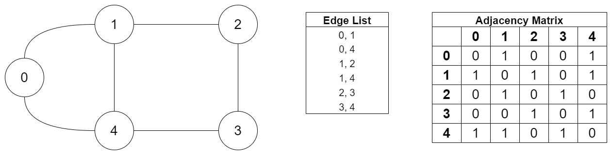
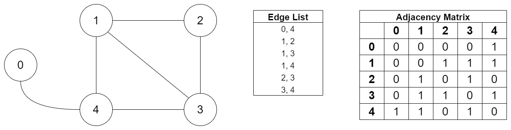

# Solve A Puzzle 

You are given the edge list of an undirected connected graph with `n` vertices and `m` edges. 

You need to create the adjacency matrix representation from the edge list.

From that adjacency list representation, you need to check if the graph has an Eulerian path.

The graph is said to have an Eulerian path if and only if it has **either 0 or 2 vertices of odd degree**. To remind, the degree of a vertex is the number of edges that are connected to the vertex.

You can draw this graph on paper without lifting the pencil from the paper and without using any edges more than once if it has an Eulerian path.

To summary, you need to convert the edge list to an adjacency matrix and using this adjacency matrix identify whether the given graph has an Eulerian path or not.
#### Example 1



The above graph has `n=5` vertices, and `m=6` edges. 
From the edge list, we first develop the adjacency matrix of size `5 x 5`.
As the graph is undirected
```
adjacencyMatrix[i][j] = 1, if there is an edge between vertex i and vertex j
adjacencyMatrix[j][i] = 1, if there is an edge between vertex i and vertex j
adjacencyMatrix[i][j] = 0, otherwise
adjacencyMatrix[j][i] = 0, otherwise
```


From the figure, we can see that:

- The degree of vertex A is 2
- The degree of vertex B is 3
- The degree of vertex C is 2
- The degree of vertex D is 2
- The degree of vertex E is 3

It has 2 vertices (vertex B and vertex E) with odd degree. Thus, the graph is said to have an Eulerian path.
We should return `true` for this case.

We can draw this graph on paper without lifting the pencil from the paper and without using any edges twice. 
If we start drawing from either vertex B or vertex E, we can draw this on paper with a continuous stroke.


#### Example 2

Let's see another example:



From the figure, we can see that:

- The degree of vertex A is 1
- The degree of vertex B is 3
- The degree of vertex C is 2
- The degree of vertex D is 3
- The degree of vertex E is 3

It has 4 vertices (vertex A, vertex B, vertex D, and vertex E) with odd degree. 
Thus, the graph does not have an Eulerian path. We should return `false` for this case.

So, we cannot draw this graph on paper without lifting the pencil from the paper and without using any edges twice. 


### Input constraints
An integer `N (1 <= N <= 100)`, the number of vertices of the graph.

An integer `M (1 <= M <= 100)`, the number of edges of the graph.

A two-dimensional integer array `edgeList` of size `M x 2` representing the 
edge list of the graph.

### Output constraints
Return `true` if the graph has an Eulerian path. Otherwise, return `false`

### Sample Input and Output

<table>
    <tr>
        <th>Sample Input 1</th>
        <th>Sample Output 1</th>
    </tr>
    <tr>
        <td>
<pre>5
6
{{0, 1},
{0, 4},
{1, 2},
{1, 4},
{2, 3},
{3, 4}}</pre>
        </td>
        <td>
            true
        </td>
    </tr>
</table>

<table>
    <tr>
        <th>Sample Input 2</th>
        <th>Sample Output 2</th>
    </tr>
    <tr>
        <td>
<pre>5
6
{{0, 4}, 
{1, 2},
{1, 3},
{1, 4},
{2, 3},
{3, 4}}
</pre>
        </td>
        <td>
            false
        </td>
    </tr>
</table>

## Code completion criteria

- Complete the method `getAdjacencyMatrix` which should return a two-dimensional integer array representing the adjacency matrix of size `n x n` for the given edge list.
- Complete the method `isEulerian` which should return a boolean value (true or false) based on the existence of an Eulerian path in the adjacency matrix.
- Run the `SAPSolution.java` and test using all the given test files in `test_cases` folder. Give the proper path of the test file (e.g.: `SolveAPuzzle/test_cases/input_1.txt`).
- Record the output of the program for each test cases as you need to include it in your report.

## Deliverables

- Complete code file.
- A PDF report containing the output of each test cases and screenshots of all successful run of the test cases. 

## Marks Distribution
- 40%: Correct generation of adjacency matrix
- 40%: Correct result for Eulerian path
- 20%: Report

### References
- [Wikipedia contributors. (2022, February 16). Degree (graph theory)](https://en.wikipedia.org/wiki/Degree_(graph_theory))